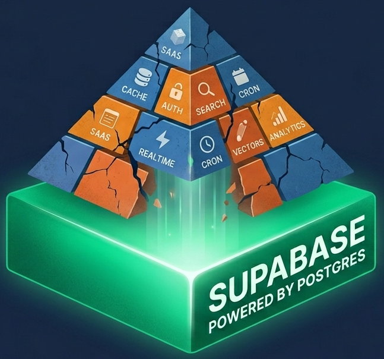

<p align="center">
  
</p>


# 🚀 Supabase Everything Playground: A Stack de Um Homem Só

Este repositório é uma prova de conceito prática baseada na filosofia  **"Postgres para Tudo"** . O objetivo é demonstrar como o **Supabase** (que é essencialmente o Postgres com superpoderes) pode substituir dezenas de serviços SaaS caros e complexos, consolidando sua infraestrutura em um único lugar.

> "Modern web development sucks... you end up paying 20 different startups to use their fancy shovels." — *Fireship*

---

## 🛠️ Os 11 Pilares da Consolidação

Abaixo estão as 11 implementações contidas neste repositório, transformando o Postgres no seu canivete suíço:

### 1. NoSQL dentro do SQL (`JSONB`)

Esqueça o MongoDB para dados não estruturados. Use o tipo `JSONB` para armazenar e consultar objetos dinâmicos com performance de índice GIN.

* **Pasta:** `/migrations/01-jsonb-nosql.sql`

### 2. Agendamento Nativo (`pg_cron`)

Substitua serviços de Cron externos. Agende limpezas de banco, disparos de e-mail ou cálculos de métricas diretamente via SQL.

* **Pasta:** `/migrations/02-cron-jobs.sql`

### 3. Cache em Memória (`Unlogged Tables`)

Precisa de performance estilo Redis? Use tabelas não logadas para dados temporários e sessões, reduzindo o overhead de escrita em disco.

* **Pasta:** `/migrations/03-cache-speed.sql`

### 4. Vector Database para IA (`pgvector`)

Armazene e consulte embeddings de IA (OpenAI, HuggingFace) para busca semântica e RAG sem precisar de um banco vetorial dedicado.

* **Pasta:** `/migrations/04-vector-search.sql`

### 5. Mecanismo de Busca (`Full-Text Search`)

Uma alternativa robusta ao Algolia/Elasticsearch usando `tsvector` e `tsquery` para buscas complexas e ranqueamento de relevância.

* **Pasta:** `/migrations/05-full-text-search.sql`

### 6. API GraphQL Nativa (`pg_graphql`)

Reflexão automática do seu esquema para GraphQL. Sem resolvers manuais, sem servidores extras.

* **Pasta:** `/migrations/06-graphql.sql`

### 7. Realtime Sync

Sincronização via WebSockets nativa do Supabase para dashboards e chats, sem configurar servidores Pub/Sub.

* **Pasta:** `/migrations/07-realtime.sql`

### 8. Identity & Security (`Auth + RLS`)

Autenticação completa e segurança a nível de linha. O banco decide quem pode ver o quê, protegendo o dado na fonte.

* **Pasta:** `/migrations/08-auth-rls.sql`

### 9. Analytics de Alta Performance

Estratégias de agregação e tabelas de séries temporais para substituir Google Analytics ou dashboards de métricas pesados.

* **Pasta:** `/migrations/09-analytics.sql`

### 10. Auto-Generated REST API

O PostgREST transforma seu esquema em uma API RESTful completa instantaneamente.

* **Pasta:** `/migrations/10-rest-api.sql`

### 11. Edge Logic (Logic Close to Data)

Usando Supabase Edge Functions (Deno) para rodar lógica de negócio o mais próximo possível do seu banco de dados.

* **Pasta:** `/supabase/functions/`

---

## 🚀 Como usar este repositório

1. **Crie um projeto gratuito** no [Supabase](https://supabase.com/).
2. **Instale o Supabase CLI** na sua máquina:
   **Bash**

   ```
   npm install supabase --save-dev
   ```
3. **Link seu projeto:**
   **Bash**

   ```
   npx supabase login
   npx supabase link --project-ref seu-projeto-id
   ```
4. **Aplique as migrations:**
   Escolha o item que deseja testar na pasta `/migrations` e execute via painel SQL do Supabase ou via CLI:
   **Bash**

   ```
   npx supabase db push
   ```

---

## 🧠 Filosofia: Por que fazer isso?

* **Redução de Custo:** Menos faturas de SaaS no final do mês.
* **Menos Latência:** Seus dados e sua lógica estão no mesmo lugar.
* **Consistência Acid:** Tudo o que o Postgres oferece de melhor para a integridade dos seus dados.
* **Simplicidade:** Uma única linguagem (SQL) para governar quase toda a sua infraestrutura.

---

## 🤝 Créditos & Inspiração

Este projeto foi inspirado no vídeo [&#34;I replaced my entire tech stack with Postgres...&#34;](https://www.youtube.com/watch?v=3JW732GrMdg) do canal  **Fireship** .

---

**Gostou dessa abordagem?** Dê uma ⭐️ no repo e vamos simplificar a web!
